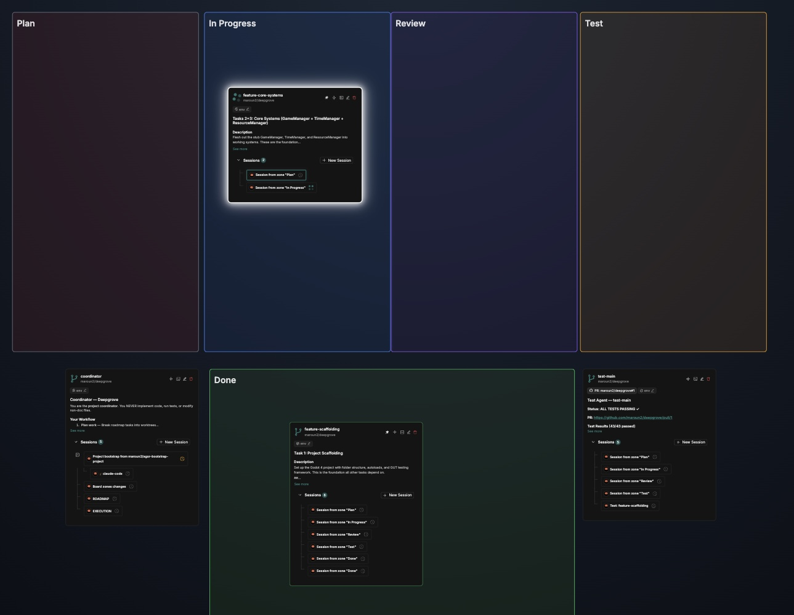

# Agor Bootstrap Project

A reusable template for setting up a [dark factory](https://simonwillison.net/2026/Jan/28/the-five-levels/) style software development pipeline in [Agor](https://agor.live). Targets **Level 4-5** AI orchestration — where AI agents handle implementation, testing, and review autonomously, while humans focus on specs, direction, and validation.

Inspired by the [five levels of AI-assisted programming](https://hackernoon.com/the-dark-factory-pattern-moving-from-ai-assisted-to-fully-autonomous-coding): from spicy autocomplete (L1) to the dark factory (L5) where specs go in and software comes out. This template sets up the coordinator, workflow zones, and agent prompts to get there.



## Features

- **Isolated test agent** — the test agent lives in its own worktree with no access to implementation code, testing purely against the API specification. This ensures tests validate behavior, not implementation details
- **Independent agent-worktrees** — each task runs in its own git worktree with a dedicated agent session, enabling safe parallel development with full code isolation
- **API-first design** — API documentation is finalized and agreed upon before any implementation begins, serving as the single source of truth for both developers and the test agent
- **Zone-based workflow** — worktrees flow through Plan → In Progress → Review → Test → Done with auto-triggered agent sessions
- **Autonomous pipeline** — agents plan, implement, review, and test without human intervention
- **Persistent coordinator** — orchestrator agent oversees the full lifecycle from concept to release
- **Interactive roadmap creation** — market research, concept refinement, and phased planning with the user
- **Resumable bootstrap** — coordinator checks existing artifacts and skips completed steps on restart
- **Reusable template** — works for any project type; just create a board and point the coordinator at this repo

## Prerequisites

- [Agor](https://agor.live) installed and running
- `gh` CLI authenticated (`gh auth status`)
- Git configured (`user.name`, `user.email`)

## How to Start

### Option A: New project (no board yet)

In any Agor session, tell the agent about your new project — name, description, what it does. Once you have that context established, give it this prompt:

```
Create a new Agor project:

1. Create a GitHub repo: `gh repo create <org>/<name> --public --description "<description>"`
   - Create initial commit and push to main
   - Register in Agor: `agor_repos_create_remote`

2. Backup the Agor database: `cp ~/.agor/agor.db ~/.agor/agor.db.backup-$(date +%Y%m%d-%H%M%S)`

3. Create a board via SQLite (`~/.agor/agor.db`):
   - Get user ID from `agor_users_get_current`
   - INSERT INTO boards (board_id, created_at, updated_at, created_by, name, slug, data)
     VALUES (
       lower(hex(randomblob(4)) || '-' || hex(randomblob(2)) || '-' || hex(randomblob(2)) || '-' || hex(randomblob(2)) || '-' || hex(randomblob(6))),
       strftime('%s', 'now') * 1000,
       strftime('%s', 'now') * 1000,
       '<user_id>',
       '<Project Name>',
       '<project-slug>',
       json('{"description":"<description>","icon":"<emoji>"}')
     );
   - Verify with `agor_boards_get`

4. Create coordinator worktree on the board
   - Name: `coordinator`
   - Set worktree notes with project context
   - Create session titled "Project bootstrap from maroun2/agor-bootstrap-project" with prompt:

You are the project coordinator for {{ board.name }}.

## Context
- **Notes:** {{ worktree.notes }}
- **Board context:** {{ board.custom_context }}

## Your Role
You oversee the entire project from concept to release. You do NOT implement —
you research, plan, discuss with the user, and orchestrate the project setup.

## Setup
1. Fetch all files from https://github.com/maroun2/agor-bootstrap-project/tree/main/doc
2. Save them to your project's doc/ directory
3. Read doc/bootstrap.md and follow the instructions step by step
```

### Option B: Existing board

If you already have a board and repo, just create the coordinator worktree and start a session:

#### Short prompt
```
Fetch all files from https://github.com/maroun2/agor-bootstrap-project/tree/main/doc
into your project's doc/ directory. Then read doc/bootstrap.md and follow the instructions.
```

## What the Coordinator Does

The coordinator handles the full bootstrap in order:

| Step | Doc | What happens |
|------|-----|--------------|
| 0 | `board-setup.md` | Set up board zones, create coordinator worktree if missing |
| 1 | `create-roadmap.md` | Market research, concept refinement, roadmap |
| 2 | `create-api-doc.md` | API documentation |
| 3 | `create-tests.md` | Test agent setup |
| 4 | `create-phase1.md` | Phase 1 task worktrees |

## Agor Skills

Reusable skills bundled in `.claude/skills/`. These are automatically discovered by Claude Code sessions running in any worktree of this repo.

| Skill | Description |
|-------|-------------|
| [`agor-board-context`](.claude/skills/agor-board-context/SKILL.md) | Generate a deterministic Markdown board context snapshot with MCP drill-down pointers |
| [`agor-bg`](.claude/skills/agor-bg/SKILL.md) | Run long-running commands in background with session notification |
| [`agor-board-setup`](.claude/skills/agor-board-setup/SKILL.md) | Set up a board with workflow zones (Plan, In Progress, Review, Test, Done) |
| [`agor-mcp-add`](.claude/skills/agor-mcp-add/SKILL.md) | Add MCP servers to Agor's database configuration |
| [`agor-session-chown`](.claude/skills/agor-session-chown/SKILL.md) | Transfer session ownership to a different user |

## agor-board-context CLI

Deterministic Markdown board context snapshot tool. Queries `~/.agor/agor.db` directly — no MCP, no LLM, no network calls.

Lives in `.claude/skills/agor-board-context/` following the standard Agor skill layout (`SKILL.md` + `scripts/`). Legacy `board-context` wrapper included for backward compatibility.

### Requirements

- `sqlite3`
- `jq`
- Agor installed (`~/.agor/agor.db` exists)

### Usage

```bash
# Print to stdout
./.claude/skills/board-context/scripts/agor-board-context <board-slug-or-id>

# Redirect to file
./.claude/skills/board-context/scripts/agor-board-context my-project > board-context.md

# By board UUID
./.claude/skills/board-context/scripts/agor-board-context fa1d135e-32e4-ade2-5837-c350f43bb1ce

# Legacy name still works
./board-context my-project
```

### What it produces

Markdown to stdout — pipe or redirect as needed. Designed to load into an agent session as starter context.

| Section | Content |
|---------|---------|
| Board header | Name, description, counts, shared worktree root, board ID |
| Zones | Trigger behavior, agent, template first-line preview with `…` |
| Worktrees | Name, repo, branch, zone, sessions, latest, notes preview, rules preview, `wt_id` |
| Key sessions | Running + long-lived (capped at 8), with last-message tail and `sess_id` |
| Pull Requests | PRs found in worktree notes (regex) or open via `gh pr list` |
| Project Docs | Planning/roadmap files deduplicated by hash, relative paths |
| Local Context | CLAUDE.md hash, skills path+count, rules path+count per worktree |

Tool-call IDs (`wt_id`, `sess_id`, board ID) appear inline on every row. Each section ends with a compact `>` note showing the MCP call template — no detached drill-down appendix.

### Options

| Flag / Env | Description |
|------------|-------------|
| `AGOR_DB` | Override database path (default: `~/.agor/agor.db`) |

### File layout

```
board-context               → backward-compat wrapper (execs agor-board-context)
.claude/skills/board-context/
├── SKILL.md                  Skill metadata + docs (frontmatter with triggers)
└── scripts/
    └── agor-board-context    Canonical script
```

### Example

See `examples/board-context-example.md` for a sanitized sample output.

## Documentation

| File | Description |
|------|-------------|
| `doc/bootstrap.md` | Step-by-step process for the coordinator |
| `doc/board-setup.md` | Zone layout and coordinator zone definition |
| `doc/create-roadmap.md` | Market research, concept refinement, roadmap creation |
| `doc/create-api-doc.md` | API documentation drafting and review |
| `doc/create-tests.md` | Test agent setup and placement |
| `doc/create-phase1.md` | Phase 1 task worktree creation |

## Workflow

```
Coordinator (outside zones, oversees everything)
        |
        v
  0. Set up board zones (if not already done)
  1. Create roadmap (interactive with user)
  2. Create API docs (interactive with user)
  3. Set up test agent (runs through pipeline, then lives outside zones)
  4. Create Phase 1 worktrees (placed in Plan zone)
        |
        v
  [ Plan ] -> [ In Progress ] -> [ Review ] -> [ Test ] -> [ Done ]
```
